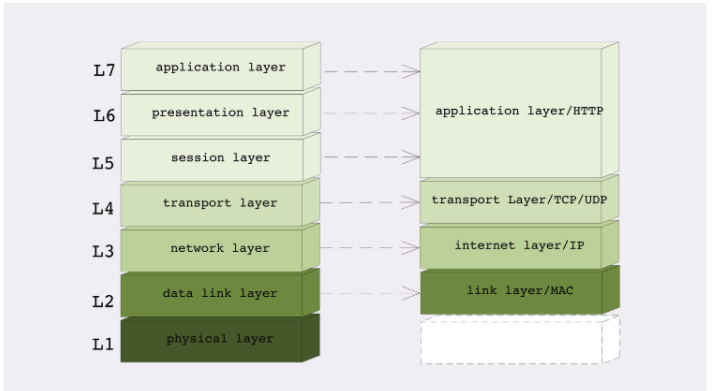
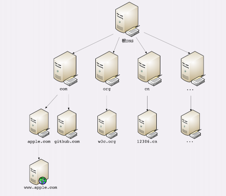

# 1. HTTP概念

## 1.1 http版本

3个版本之间的区别 https://blog.fundebug.com/2019/03/07/understand-http2-and-http3/

### 版本1

目前最广泛的http协议是1.1版本

### 版本2

google在chrome浏览器中使用了新的SPDY协议，倒逼http推出了http2:

1. 二进制协议，不再是纯文本(只要是HTTP/1.1，就都是文本格式，虽然里面的数据可能是二进制，但分隔符还是文本)，能将请求和响应数据分为更小的帧；
2. 多路复用，废弃了 1.1 里的管道，多路复用很好的解决了浏览器限制同一个域名下的请求数量的问题，同时也接更容易实现全速传输，毕竟新开一个 TCP 连接都需要慢慢提升传输速度，同域名下所有通信都在单个连接上完成，该连接可以承载任意数量的双向数据流。每个数据流都以消息的形式发送，而消息又由一个或多个帧组成。多个帧之间可以乱序发送，根据帧首部的流标识可以重新组装；
3. 使用专用算法压缩头部，在同个连接存在期间可以减少数据传输量；
4. 允许服务器主动向客户端推送数据；

### 版本3

现在google又推出了新的QUIC协议，推出了http3

QUIC 基于 UDP 实现，是 HTTP/3 中的底层支撑协议，该协议基于 UDP，又取了 TCP 中的精华，实现了即快又可靠的协议，只需要0个RTT就可以实现数据发送，且重传机制不会影响到整个多路复用连接

另外 QUIC 在移动端的表现也会比 TCP 好。因为 TCP 是基于 IP 和端口去识别连接的，这种方式在多变的移动端网络环境下是很脆弱的。但是 QUIC 是通过 ID 的方式去识别一个连接，不管你网络环境如何变化，只要 ID 不变，就能迅速重连上。

## 1.2 什么是http

- URI：即统一资源标识符，作为互联网上资源的唯一身份；

- HTML：即超文本标记语言，描述超文本文档；
- URL: 统一资源定位符

- HTTP：即超文本传输协议，用来传输超文本。
- WWW：万维网是互联网中的一部分，互联网包括了邮件系统、电缆之类的硬件，万维网只是在互联网基础之上提供的一种信息服务

1. HTTP 是一个用在计算机世界里的协议，它确立了一种计算机之间交流通信的规范，以及相关的各种控制和错误处理方式。
2. HTTP 专门用来在两点之间传输数据，不能用于广播、寻址或路由。
3. HTTP 传输的是文字、图片、音频、视频等超文本数据。
4. HTTP 是构建互联网的重要基础技术，它没有实体，依赖许多其他的技术（TCP、IP等）来实现，但同时许多技术也都依赖于它。

## 1.3 四层和七层协议

OSI 的分层模型在四层以上分的太细，而 TCP/IP 实际应用时的会话管理、编码转换、压缩等和具体应用经常联系的很紧密，很难分开。例如，HTTP 协议就同时包含了连接管理和数据格式定义。

### 四层协议（TCP/IP 协议）

1. 链路层（mac ，frame）
2. 网络层（ip，packet）
3. 传输层（segment）
4. 应用层（message）

### 七层协议（**OSI**）

TCP/IP协议诞生的时间比较早，那个时候存在多种网络协议，后来国际标准组织设计出了一个新的网络分层模型，想用这个新框架来统一既存的各种网络协议。

1. 第一层：物理层，网络的物理形式，例如电缆、光纤、网卡、集线器等等；
2. 第二层：数据链路层，它基本相当于 TCP/IP 的链接层；
3. 第三层：网络层，相当于 TCP/IP 里的网际层；
4. 第四层：传输层，相当于 TCP/IP 里的传输层；
5. 第五层：会话层，维护网络中的连接状态，即保持会话和同步；
6. 第六层：表示层，把数据转换为合适、可理解的语法和语义；
7. 第七层：应用层，面向具体的应用传输数据（CDN和DNS就属于这一层）。

### 负载均衡

“四层负载均衡”就是指工作在传输层上，基于 TCP/IP 协议的特性，例如 IP 地址、端口号等实现对后端服务器的负载均衡。

“七层负载均衡”就是指工作在应用层上，看到的是 HTTP 协议，解析 HTTP 报文里的 URI、主机名、资源类型等数据，再用适当的策略转发给后端服务器。

## 1.4 域名解析

DNS 的核心系统是一个三层的树状、分布式服务，基本对应域名的结构：

1. 根域名服务器（Root DNS Server）：管理顶级域名服务器，返回“com”“net”“cn”等顶级域名服务器的 IP 地址；
2. 顶级域名服务器（Top-level DNS Server）：管理各自域名下的权威域名服务器，比如 com 顶级域名服务器可以返回 apple.com 域名服务器的 IP 地址；
3. 权威域名服务器（Authoritative DNS Server）：管理自己域名下主机的 IP 地址，比如 apple.com 权威域名服务器可以返回 www.apple.com 的 IP 地址。

许多大公司、网络运行商都会建立自己的 DNS 服务器，作为用户 DNS 查询的代理，代替用户访问核心 DNS 系统。这些“野生”服务器被称为“非权威域名服务器”，可以缓存之前的查询结果，如果已经有了记录，就无需再向根服务器发起查询，直接返回对应的 IP 地址。